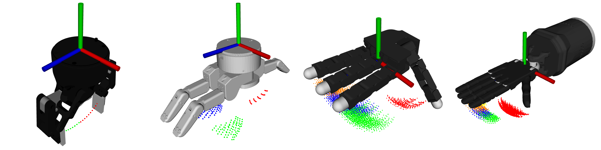
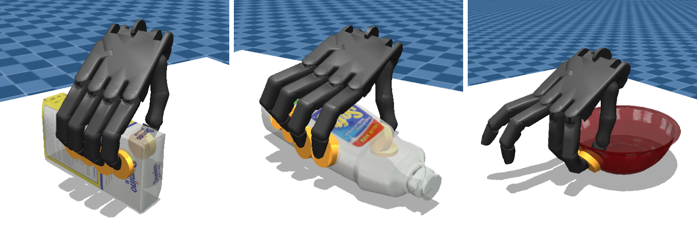
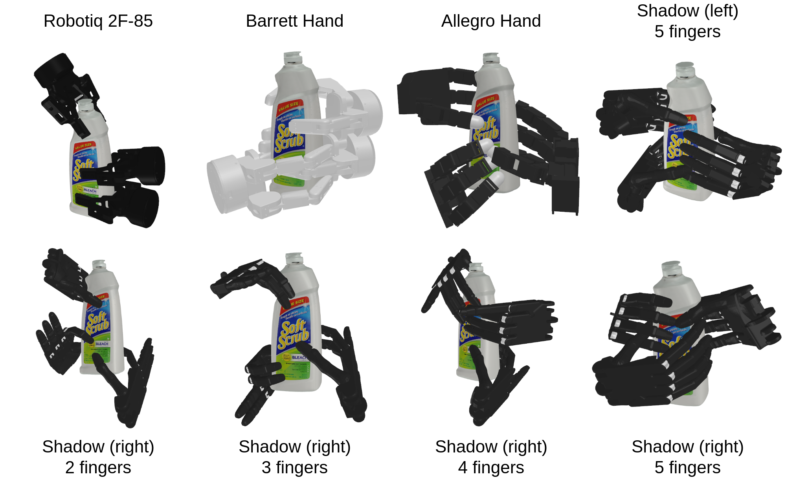

# FSG
Fingertip-contact-aware Sampling-based Grasp Generator

## 1. Project Structure

- **`assets/`** — Contains object and robot resources.
  - **`obj/`** — Object meshes (`.obj`) and point clouds (`.pcd`)
    - **`keyframes/`** — Grasp demonstrations
    - **`toolkits/`** — Mesh-to-pointcloud conversion scripts
  - **`robot/`** — Robot URDF and XML models
- **`cmake/`** — CMake configuration files
- **`config/`** — YAML configs for AutoWS and FSG
- **`docker/`** — Dockerfile to build FSG environment
- **`hdf5/`** — Grasp data generated by FSG
- **`include/fsg/`** — FSG header files
- **`launch/`** — ROS launch files
- **`scripts/`**
  - **`autows/`** — Scripts for AutoWS
  - **`grasp_gen/`** — Scripts for grasp data generation
- **`src/`** — FSG source code
- **`srv/`** — ROS service definitions
- **`workspace/`** — Fingertip workspace clouds generated by AutoWS

## 2. Installation

* FSG is built on ROS Noetic, which will no longer be officially supported after May 2025. We recommend using Docker to run FSG for better compatibility.

### 2.1 Build FSG in docker

Pull existing docker image from Docker Hub:
```
docker pull wu567/fsg:0.1
```

Or build the image locally:
```
git clone https://github.com/W567/FSG.git
cd FSG/docker
docker build . -t fsg
```

Start the docker container:
```
docker run -it --name fsg --env="DISPLAY" --env="QT_X11_NO_MITSHM=1" --volume="/tmp/.X11-unix:/tmp/.X11-unix:rw" wu567/fsg:0.1
# Remember to source catkin_ws/devel/setup.bash in the docker container before running AutoWS and FSG
cd ~/catkin_ws
source devel/setup.bash
```

### 2.2 Build FSG from source
```
# https://www.cgal.org/download/linux.html
sudo apt install libcgal-dev libopencv-dev

mkdir -p catkin_ws/src
cd catkin_ws/src
git clone https://github.com/W567/FSG.git
rosdep init
rosdep update
rosdep install --from-paths . --ignore-src --rosdistro noetic
wstool init .
wstool merge -t . fsg/.fsg.rosinstall
wstool update -t .
catkin build fsg
```

#### 2.2.1 Setup for AutoWS

Scripts of AutoWS in FSG/scripts/autows is used to generate robot fingertip workspace clouds based on robot urdf models. 

To use AutoWS, please install dependencies as:

```
pip install trimesh mujoco lxml scikit-robot sympy matplotlib
pip uninstall -y pyrender && pip install git+https://github.com/mmatl/pyrender.git --no-cache-dir
```

#### 2.2.2 Setup for obj2pcd

We provide scripts to sample point cloud from object .obj mesh file and extract desired partial point cloud. Corresponding scripts are stored in FSG/assets/obj/toolkits.

obj2pcd depends on [pc_annotation](https://github.com/W567/pc_annotation), which is a plugin of the Open3D visualizer. To use pc_annotation for extracting selected points from the original cloud, please build Open3D from source folowing the [official instruction](https://www.open3d.org/docs/release/compilation.html), and then build [pc_annotation](https://github.com/W567/pc_annotation).


## 3. Usage

### 3.1 Generate workspace clouds with AutoWS



#### 3.1.1 Generate workspace clouds without grasp demonstrations
```
cd FSG/scripts/autows
python autows.py --robot srh 
# To visualize the generation procedure
python autows.py --robot srh --debug
```
Generated workspace clouds will be saved under FSG/workspace/, with robot name as the folder name.

#### 3.1.2 Generate workspace clouds with grasp demonstrations



```
# Check grasp demonstration with
python FSG/scripts/read_keyframe.py --robot srh --vis
python autows.py --robot srh --key 1 --separate --aug
# To generate workspace clouds of all available grasp demonstrations:
python ws_gen.py
```

Generated workspace clouds will be saved under FSG/workspace/, with object name as the folder name (currently only for srh).

### 3.2 Generate grasp poses with FSG
```
roslaunch FSG/launch/gen_grasp.launch

# To visualize the generated grasp poses
python FSG/scripts/grasp_gen/reader_grasp.py -r srh --file grasp_res.h5 --obj ycb_004_sugar_box
# To visualize the palm postions of all generated grasp poses in the dataset
python FSG/scripts/grasp_gen/reader_grasp.py -r srh --file grasp_res.h5 --obj ycb_004_sugar_box --vis_all
```



### 3.3 Generate point cloud of additional objects
```
python FSG/assets/obj/toolkits/obj2pcd.py -i *path_to_folder_contain_obj_mesh* -o *path_to_folder_to_store_pcd* -v -aff
```


### 3.4 To use AutoWS and FSG with new robot hands

FSG is a class template with number of fingers $N_f$ and maximum number of joints per finger $N_a$ as template parameters.
Currently supported combinations of $[N_a, N_f]$ are:
- [1, 2] (Robotiq 2F-85)
- [3, 3] (Barrett)
- [4, 3]
- [4, 4] (Allegro)
- [5, 5] (Srh)

If the $[N_a, N_f]$ combination of your robot hand is not listed above,
please add the new combination to FSG/src/main.cc,
add corresponding point cloud type (related to $N_a$ only) to FSG/include/fsg/cloud_type.h if necessary, and rebuild the project.

To generate the workspace clouds of the new robot hand, please add the autows.yaml configuration file to FSG/config/*robot_hand_name*,
please take a reference to the existing autows.yaml files of other robot hands.

Attention:
1. If AutoWS.py takes too long to generate the workspace clouds, 
it is usually because the cloud to be generated contains too many points (too many joint combinations).
Please try to set the angle step larger, or set the target joint angle range smaller.
